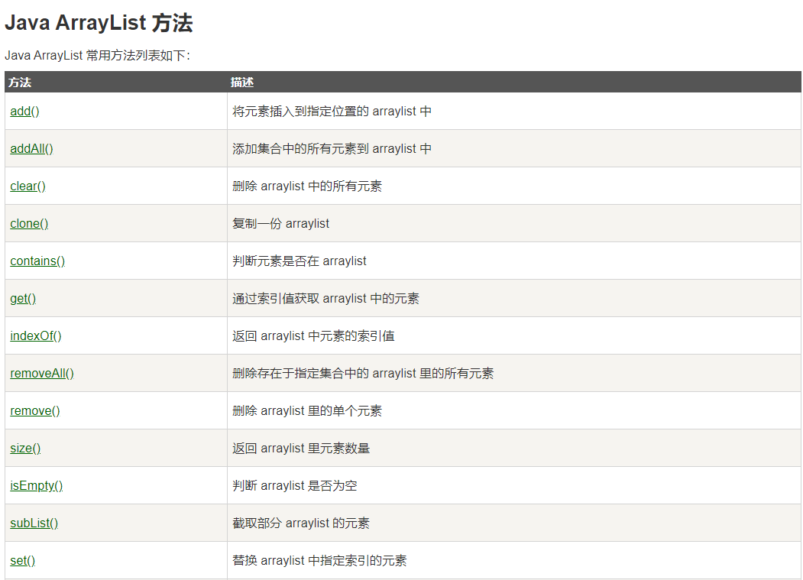
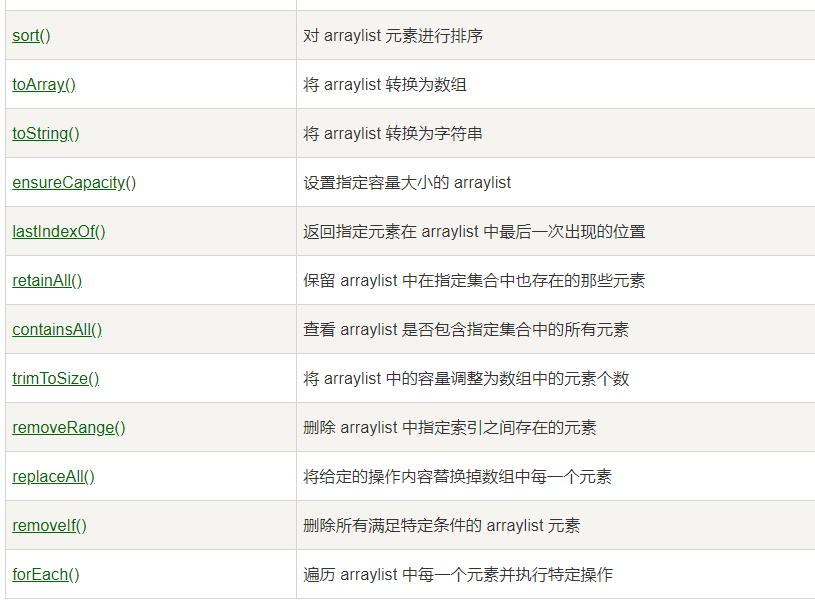
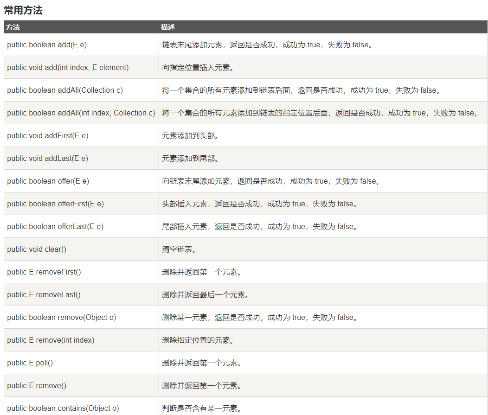
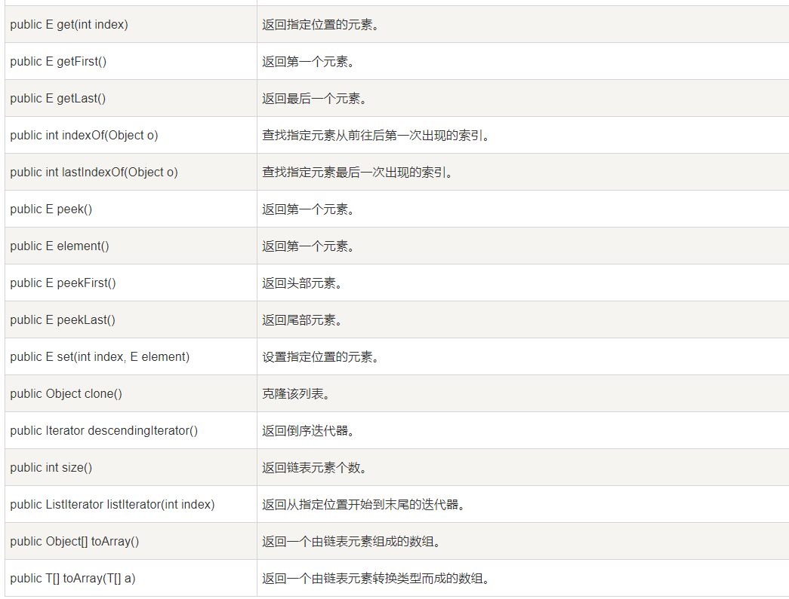

Day06

集合用于弥补数组的缺点（定长），用于存储多个数据，并可以以变长 的方式进行读写访问。

java中的集合有两大类：

Clooection 接口 用于存储层次结构的数据类型

List 接口 列表 可以存储重复的数据并按照写入的顺序连续存储

arraylist 动态数组 底层通过object\[\]来实现的

linkedlist 链表

Set 接口 不能存储重复的数据，写入的数据是无序排列

Map 接口 用于存储键值结构的数据类型，键用于唯一标识每个值的

Arrylist在构建实例时，底层默认创建一个长度为10的object数组：new object\[10\]

当集合中的元素超过最大长度时，集合会重新创建一个新的数组，长度为当前数组长度的1.5倍，通过算法将原数组的值复制到新的数组中

Arrylist的特点：查询有着优异的性能，但是在执行新增存在性能上的下降，执行删除性能较差

Linkedlist 的特点：执行增删性能优异，但是在执行查询到 时候性能较差，越靠近链表首位的元素查询响应时间就越短

DAO database access object 数据访问对象

将数据对象常用的访问方法（增删改查）封装在指定的对象中，该对象就称为DAO对象

DAO对象时数据层构建的基础，由业务层对象进行调用

DAO中定义的数据访问方法和业务无关

